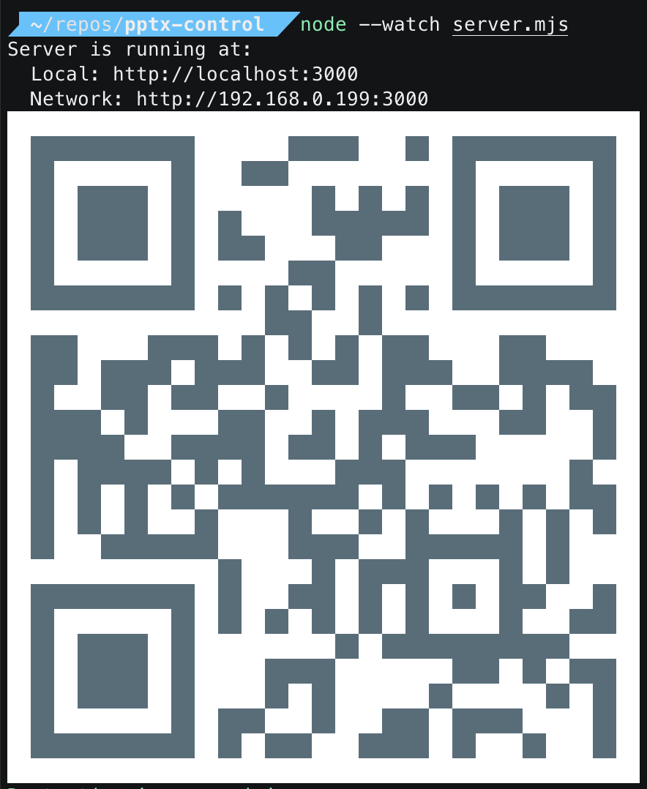

# PowerPoint Remote Control

A mobile-friendly web interface for remote PowerPoint control using your phone as a remote. Control presentations with simple touch gestures and volume buttons.



## Features

### 🎯 Core Functionality
- **Slide Navigation**: Tap left/right sides of screen to advance/previous slides
- **Volume Control**: Use phone volume buttons to trigger clicks
- **PowerPoint Integration**: Direct control of PowerPoint application
- **Fullscreen Mode**: Immersive presentation experience

### 📱 Mobile Interface
- **Responsive Design**: Works on any mobile device
- **Touch Controls**: Large, easy-to-tap navigation areas
- **Visual Feedback**: Clear visual indicators for all actions
- **Network Access**: QR code for easy connection

### 🛠️ Control Options
- **Focus PowerPoint**: Bring PowerPoint to front
- **Start Slideshow**: Begin presentation (F5)
- **Exit Slideshow**: End presentation (Escape)
- **Fullscreen Mode**: Toggle web app fullscreen

### 🔧 Debug Features
- **Comprehensive Logging**: Monitor all events and requests
- **Volume Testing**: Built-in video player for volume control testing
- **Event Monitoring**: Track touch, scroll, and device events
- **Performance Metrics**: Response times and success rates

## Installation

### Prerequisites
- Node.js (v14 or higher)
- npm or yarn
- PowerPoint (Microsoft Office)

### Setup
1. **Clone the repository**
   ```bash
   git clone git@github.com:kokarn/pptx-control.git
   cd pptx-control
   ```

2. **Install dependencies**
   ```bash
   npm install
   ```

3. **Start the server**
   ```bash
   node server.mjs
   ```

4. **Access the interface**
   - The server will display local and network URLs
   - Scan the QR code with your phone for easy access
   - Or manually navigate to the displayed URL

## Usage

### Basic Navigation
1. **Start PowerPoint** and open your presentation
2. **Access the web interface** on your phone
3. **Tap "Focus PowerPoint"** to bring PowerPoint to front
4. **Tap "Start Slideshow"** to begin the presentation
5. **Navigate slides** by tapping left/right sides of the screen

### Volume Control
- **Use phone volume buttons** to trigger mouse clicks
- **Test volume controls** using the debug page (`/debug.html`)
- **Custom volume slider** available for testing

### Advanced Features
- **Fullscreen mode**: Tap "Fullscreen" for immersive experience
- **Debug monitoring**: Visit `/debug.html` for comprehensive logging
- **Network access**: Works across your local network

## API Endpoints

| Endpoint | Method | Description |
|----------|--------|-------------|
| `/` | GET | Main interface |
| `/debug.html` | GET | Debug page with monitoring |
| `/click` | GET | Trigger mouse click |
| `/click-left` | GET | Press left arrow key |
| `/click-right` | GET | Press right arrow key |
| `/focus-powerpoint` | GET | Focus PowerPoint application |
| `/start-slideshow` | GET | Start PowerPoint slideshow |
| `/exit-slideshow` | GET | Exit PowerPoint slideshow |

## Platform Support

### ✅ Supported
- **macOS**: Full support with AppleScript integration
- **Windows**: Basic support (PowerPoint control via keyboard)
- **Mobile Browsers**: iOS Safari, Chrome, Firefox
- **Desktop Browsers**: Chrome, Firefox, Safari, Edge

### 🔧 Requirements
- **PowerPoint**: Microsoft PowerPoint must be installed
- **Network**: Both devices must be on same network
- **Permissions**: May require microphone/volume permissions on mobile

## Troubleshooting

### Common Issues

**PowerPoint not responding**
- Ensure PowerPoint is installed and accessible
- Try the "Focus PowerPoint" button first
- Check if PowerPoint is in slideshow mode

**Volume controls not working**
- Grant volume permissions to your browser
- Test with the debug page (`/debug.html`)
- Try the custom volume controls

**Network connection issues**
- Ensure both devices are on the same network
- Check firewall settings
- Try the localhost URL if network URL fails

**Mobile interface not loading**
- Clear browser cache
- Try a different browser
- Check if JavaScript is enabled

### Debug Mode
Visit `/debug.html` to:
- Test all endpoints individually
- Monitor volume change events
- View comprehensive event logs
- Test touch and gesture controls

## Development

### Project Structure
```
pptx-control/
├── server.mjs          # Express server with endpoints
├── public/
│   ├── index.html      # Main mobile interface
│   └── debug.html      # Debug and testing interface
├── package.json        # Dependencies and scripts
└── README.md          # This file
```

### Key Technologies
- **Backend**: Node.js, Express.js
- **Frontend**: HTML5, CSS3, JavaScript
- **Automation**: RobotJS for system control
- **QR Codes**: qrcode-terminal for easy access

### Contributing
1. Fork the repository
2. Create a feature branch
3. Make your changes
4. Test thoroughly
5. Submit a pull request

## License

This project is open source and available under the MIT License.

## Support

For issues, questions, or contributions:
- Create an issue on GitHub
- Check the debug page for troubleshooting
- Review the troubleshooting section above

---

**Happy presenting! 🎤📊**
